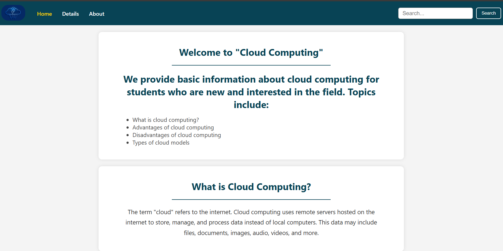

# 🌩️ Cloud Computing Basics Website

A beginner-friendly educational webpage introducing the fundamentals of **Cloud Computing**. This project is ideal for students or anyone interested in understanding the core concepts, advantages, disadvantages, and different models of cloud computing.

---

## 📄 Project Overview

This simple static website contains the following sections:

- **Home** – Introduction to Cloud Computing
- **Details** – What is Cloud Computing?
- **Advantages** – Key benefits of using the cloud
- **Disadvantages** – Limitations and risks
- **Cloud Models** – Overview of Public, Private, Hybrid, and Community cloud models

---

## 🛠️ Tech Stack

- **HTML5** – Structure
- **CSS3** – Styling and layout
- **Responsive Design** – Mobile-friendly view using CSS media queries

---

## 📁 Project Structure

```plaintext
.
├── index.html           # Main HTML file containing all content
├── style.css            # CSS file for layout and styling
├── Screenshot1.png      # Screenshot of the website
├── cloud_computing.jpg  # Image used in the header logo
└── README.md            # Project description

## 📸 Website Preview

Here’s a preview of the website interface:



